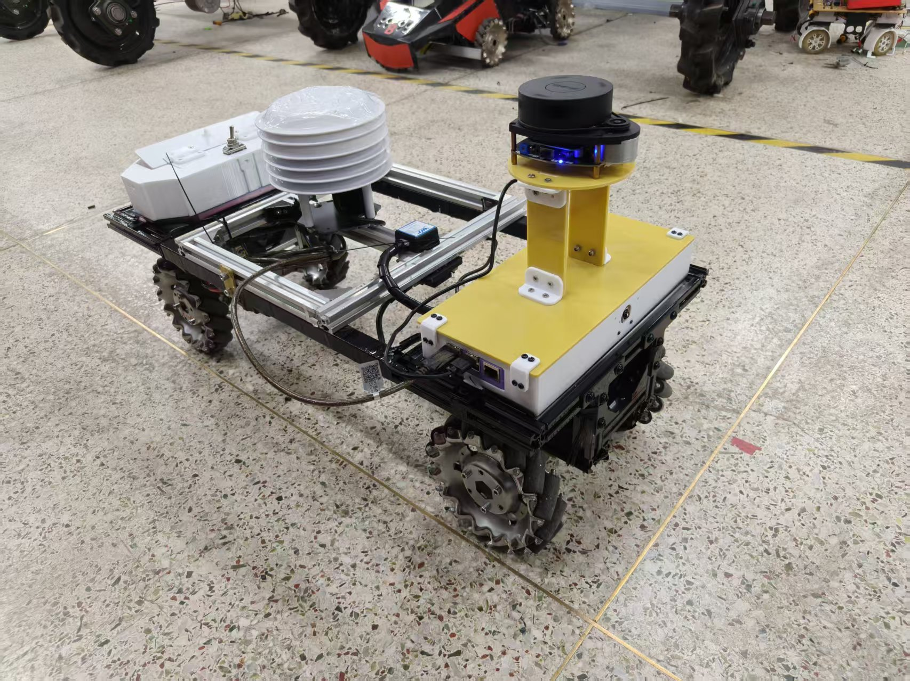
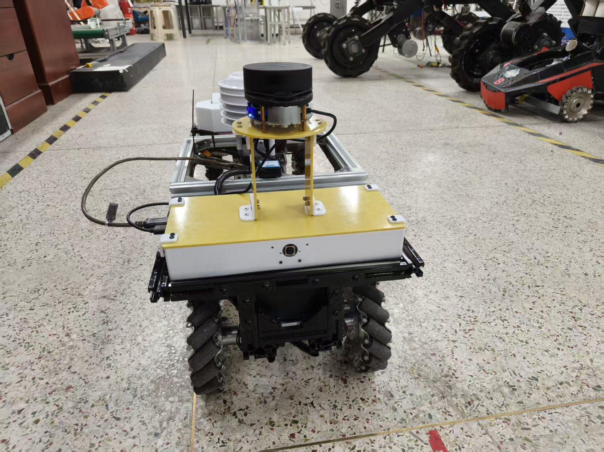

# Greenhouse Mecanum Robot

A greenhouse mobile robot based on **STM32F407 + Raspberry Pi 4 + ROS 2 Jazzy + Nav2 MPPI Omni**.

This project was developed and validated on a real four-wheel mecanum robot for greenhouse navigation, manual takeover, environmental sensing and remote monitoring.

## Project Highlights

- Built a complete mobile robot system from STM32 chassis control to ROS 2 autonomous navigation.
- Implemented four-wheel mecanum kinematics, wheel-speed closed-loop control, encoder feedback and IMU yaw processing on STM32F407.
- Integrated ROS 2 Jazzy, AMCL and Nav2 MPPI Omni on Raspberry Pi 4.
- Built the real-vehicle control chain from `NavigateToPose` to STM32 motor control, including velocity smoothing, collision monitoring and high-priority gamepad takeover.
- Diagnosed and solved system-level issues including Raspberry Pi 4 overload, Nav2 lifecycle resets, odometry yaw drift, USB device instability and camera-stream freezing.
- Completed real-vehicle validation, environmental sensing, remote video monitoring and engineering handover documentation.

> **Repository Scope**
>
> This repository contains the open-source STM32 chassis firmware, preserved Nav2 configuration snapshots and tuning history, engineering documentation, and real-vehicle validation materials.
>
> The original Raspberry Pi ROS 2 application-layer source code was not fully preserved. Its architecture, package responsibilities, launch/config references and validated behavior are documented from the original engineering records.

---

## Demo

### Real Robot Platform

<p align="center">
  
  
</p>

### Project Evolution

[▶ Watch the project evolution video](media/greenhouse_robot_project_evolution.mp4)

This video documents the development of the robot from early chassis bringup to the final integrated system, including low-level motion control, ROS 2 integration, localization, navigation, sensing and real-vehicle testing.

<p align="center">
  <em>Four-wheel mecanum greenhouse mobile robot used for real-world navigation and system integration tests.</em>
</p>

The robot was validated on a real four-wheel mecanum platform using ROS 2 Jazzy, Nav2, AMCL and the MPPI Omni controller.

---

## Hardware

- STM32F407ZGT6
- Raspberry Pi 4
- Four-wheel mecanum chassis
- RPLIDAR A1
- WIT IMU
- Four wheel encoders
- IMX219 camera
- RS485 environmental sensor

---

## Software Stack

### Onboard Computer

- Ubuntu 24.04
- ROS 2 Jazzy
- Nav2
- AMCL
- MPPI Controller
- Omni motion model
- velocity_smoother
- collision_monitor
- twist_mux

### Embedded Controller

- STM32F407ZGT6
- STM32 HAL / CMSIS
- STM32CubeMX
- Keil MDK-ARM
- Mecanum kinematics
- Wheel-speed closed-loop control
- Encoder odometry
- IMU yaw processing
- UART communication with the ROS 2 onboard computer

---

## System Architecture

```text
                      Goal Pose
                          │
                          ▼
                    Nav2 Planner
                          │
                          ▼
                MPPI Omni Controller
                          │
                          ▼
                 Velocity Smoother
                          │
                          ▼
                 Collision Monitor
                          │
                          ▼
Gamepad Override ─────► twist_mux
                          │
                          ▼
                 ROS 2 Serial Bridge
                          │
                        UART
                          │
                          ▼
                STM32 Chassis Controller
                          │
                          ▼
              Mecanum Wheel Velocity Control
                          │
                          ▼
                     Four Motors
```

The localization / TF chain used on the robot was:

```text
map
 │
 │ AMCL
 ▼
odom
 │
 │ encoder + IMU based odometry
 ▼
base_link
 │
 │ static transform
 ▼
laser
```

---

## STM32 Firmware Architecture

The STM32 firmware implements the real-time low-level chassis-control layer.

Main modules include:

- `chassis_ctrl` — mecanum kinematics, wheel-speed control and chassis state
- `chassis_hw` — chassis hardware abstraction
- `MotorHAL` — motor-control interface
- `EncoderHAL` — wheel-encoder interface
- `imu_yaw` — yaw integration and gyro-bias handling
- `wit_imu_hal` — WIT IMU integration layer
- `ros_serial_proto` — STM32 / ROS 2 serial protocol
- `robot_app` — application-level state and module coordination

Detailed documentation:

- [STM32 Firmware Architecture](docs/stm32_firmware_architecture.md)

---

## ROS 2 Control Chain

The validated real-vehicle command path was:

```text
Nav2
 │
 ▼
MPPI Controller
 │
 ▼
/cmd_vel_nav
 │
 ▼
velocity_smoother
 │
 ▼
collision_monitor
 │
 ▼
/cmd_vel_nav_safe
 │
 ▼
twist_mux  ◄──── Gamepad Override
 │
 ▼
/cmd_vel_robot
 │
 ▼
base_serial_bridge
 │
 ▼
STM32
 │
 ▼
Four-wheel mecanum chassis
```

The gamepad path had higher priority than autonomous navigation so that the operator could take over the robot when required.

---

## Navigation

The final navigation architecture was based on:

- Nav2
- AMCL localization
- MPPI Controller
- Omni motion model
- mecanum-compatible velocity limits
- local and global costmaps
- velocity smoothing
- collision monitoring
- gamepad takeover through `twist_mux`

The robot completed real-vehicle `NavigateToPose` tests including target approach, final orientation adjustment and automatic stop.

---

## Nav2 Configuration

Historical Nav2 configuration snapshots are preserved under:

```text
config/tuning_history/
```

> **Important**
>
> The exact final September 10–11 Nav2 YAML file was not preserved.
>
> The preserved YAML files are therefore treated as historical engineering snapshots rather than falsely presented as the exact final production configuration.

The main preserved parameter-audit snapshot is:

```text
config/tuning_history/nav2_params_mecanum_20260909_audit.yaml
```

The final documented vehicle baseline included:

- controller frequency: `10 Hz`
- MPPI `time_steps = 30`
- MPPI `model_dt = 0.10`
- MPPI `batch_size = 1000`
- `visualize = false`
- `costmap_update_timeout = 0.50 s`
- `failure_tolerance = 1.00 s`
- `FollowPath.transform_tolerance = 0.30 s`
- local costmap: `ObstacleLayer + InflationLayer`
- global costmap: `StaticLayer + ObstacleLayer + InflationLayer`
- `always_send_full_costmap = false`
- lifecycle `bond_timeout = 10.0 s`

See:

- [Nav2 / MPPI Tuning and Stability](docs/nav2_tuning.md)

---

## STM32 / ROS 2 Communication

The Raspberry Pi communicated with the STM32 chassis controller through a UART ASCII protocol.

Supported commands include:

```text
V vx vy wz
STOP
RESET_ODOM
PING
```

The STM32 periodically returns chassis-state information to the Raspberry Pi for odometry and system monitoring.

Detailed documentation:

- [STM32 / ROS 2 Serial Protocol](docs/serial_protocol.md)

---

## Environmental Sensing

The robot integrated an RS485 environmental sensor through Modbus-RTU.

Measured quantities included:

- temperature
- humidity
- noise
- PM2.5
- PM10

The ROS 2 system published these measurements through dedicated `/environment/*` topics at approximately `1 Hz`.

Stable USB device identification used `/dev/serial/by-id` instead of dynamic `ttyUSB` numbering.

---

## Camera and Remote Monitoring

The robot used an IMX219 camera connected to the Raspberry Pi.

The final video pipeline used:

```text
IMX219
  ↓
libcamera / GStreamer
  ↓
hardware H.264 encoder
  ↓
go2rtc
  ↓
browser / RTSP / WebRTC
```

The final low-load operating baseline used:

- 640×360
- 10 FPS
- H.264
- CBR 600 kbps
- I-frame period: 10 frames

---

## Validated Functions

The following functions were validated on the real robot:

- STM32 four-wheel velocity closed-loop control
- Mecanum forward / inverse motion
- Wheel encoder feedback
- IMU yaw integration
- ROS 2 serial bridge
- ROS 2 odometry and TF chain
- RPLIDAR A1 scan input
- AMCL localization
- Nav2 `NavigateToPose`
- MPPI Omni control
- Automatic stop at target
- Final goal orientation adjustment
- High-priority gamepad takeover
- RS485 environmental sensor integration
- IMX219 browser video streaming
- Cold-start recovery using the documented operating procedure

---

## Repository Structure

```text
greenhouse-mecanum-robot/
├── README.md
├── LICENSE
├── THIRD_PARTY_NOTICES.md
├── .gitignore
│
├── firmware/
│   ├── README.md
│   └── stm32/
│       ├── Core/
│       │   ├── Inc/
│       │   └── Src/
│       ├── Drivers/
│       ├── MDK-ARM/
│       └── dfh1.0.ioc
│
├── config/
│   ├── README.md
│   └── tuning_history/
│       ├── README.md
│       ├── nav2_params_mecanum_20260909_audit.yaml
│       └── historical tuning snapshots
│
├── docs/
│   ├── system_architecture.md
│   ├── stm32_firmware_architecture.md
│   ├── serial_protocol.md
│   ├── nav2_tuning.md
│   ├── odometry_and_tf.md
│   ├── field_validation.md
│   ├── bringup_and_operation.md
│   └── fault_analysis.md
│
├── media/
│   ├── README.md
│   └── real-vehicle photos and demonstration materials
│
└── archive/
    └── engineering records
```

---

## Documentation

### Available

- [System Architecture](docs/system_architecture.md)
- [STM32 Firmware Architecture](docs/stm32_firmware_architecture.md)
- [STM32 / ROS 2 Serial Protocol](docs/serial_protocol.md)
- [Nav2 / MPPI Tuning and Stability](docs/nav2_tuning.md)
- [Odometry and TF Engineering](docs/odometry_and_tf.md)
- [Real-Vehicle Validation](docs/field_validation.md)
- [Bringup and Operation Guide](docs/bringup_and_operation.md)
- [Fault Analysis and Debugging](docs/fault_analysis.md)

---

## Source-Code Availability

### Available in this repository

- STM32 chassis firmware
- STM32CubeMX project
- Keil MDK project
- preserved Nav2 configuration snapshots
- historical Nav2 tuning snapshots
- engineering documentation
- real-vehicle photos and demonstration materials

### Not fully preserved

The original Raspberry Pi ROS 2 application-layer source tree was not completely backed up before the original development environment was retired.

The missing original source included components such as:

```text
base_serial_bridge
base_odometry
gamepad_teleop
environment_sensor
custom launch files
```

Their architecture and validated behavior are preserved through the project's engineering records.

Any future reimplementation of these missing modules will be clearly marked as **reconstructed code**, rather than presented as the original vehicle-tested source.

---

## Third-Party Software

This repository contains or depends on third-party components.

### STMicroelectronics

STM32 HAL and CMSIS components remain subject to their original STMicroelectronics copyright and license terms.

### WIT Motion

The project interfaces with a WIT Motion IMU.

The original vendor SDK is treated as an external dependency and is not redistributed as project-authored MIT code.

See:

- [Third-Party Notices](THIRD_PARTY_NOTICES.md)

---

## Project Status

The physical robot and its integrated control/navigation stack completed real-vehicle testing.

Current repository work focuses on:

- preserving the validated STM32 firmware
- documenting the original ROS 2 architecture
- preserving Nav2 tuning history
- publishing engineering lessons and validation evidence
- organizing the project as a reproducible robotics engineering portfolio

---

## Known Limitations

- The original Raspberry Pi ROS 2 application-layer source code was not fully preserved.
- The exact final Nav2 YAML used during the final September 10–11 vehicle validation was not preserved.
- Historical configuration snapshots are therefore labeled as development records rather than exact final production files.
- WIT Motion vendor SDK source is treated as an external dependency.

---

## License

Project-authored code is released under the **MIT License**, unless otherwise stated.

Third-party software remains subject to its respective license terms.

See:

- [LICENSE](LICENSE)
- [THIRD_PARTY_NOTICES.md](THIRD_PARTY_NOTICES.md)
